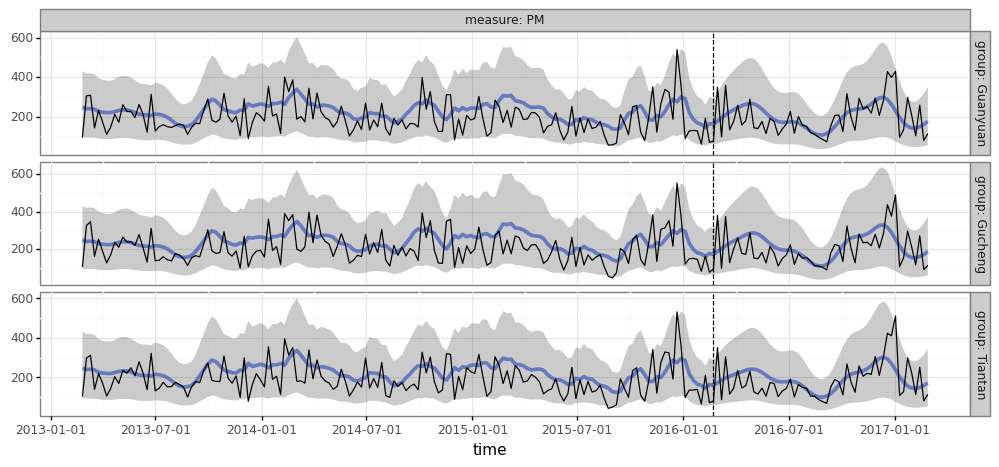

torchcast
=====================================

``torchcast`` is a Python package for forecasting built on top of |PyTorch|. Its focus is on training and forecasting with *batches* of time-serieses, rather than training separate models for one time-series at a time. In addition, it provides robust support for *multivariate* time-series, where multiple correlated measures are being forecasted.

.. toctree::
   :maxdepth: 1

   quick_start
   examples/examples
   api/api

.. include:: macros.hrst

Getting Started
---------------

``torchcast`` can be installed with `pip`:

.. code-block:: bash

    pip install git+https://github.com/strongio/torchcast.git#egg=torchcast

``torchcast`` requires Python >= 3.6 and |PyTorch| >= 1.7.

See the :doc:`quick_start` for a simple example that will get you up to speed, or delve into the :doc:`examples/examples` or :doc:`api/api`.
